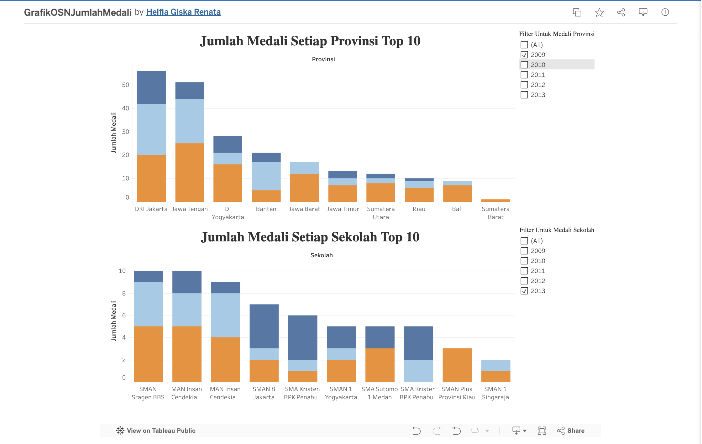
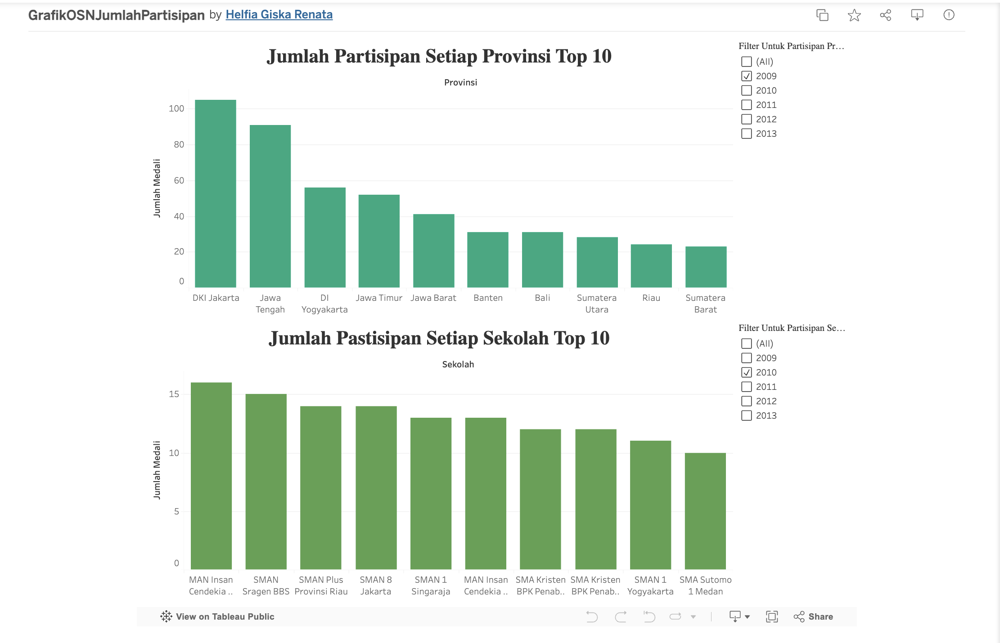

# OSN Dashboard — Olimpiade Sains Nasional

A data warehouse project built for university coursework at Politeknik Caltex Riau (TA 2024/2025), analysing Indonesia's National Science Olympiad across schools, provinces, medal types, and years — with a sentiment analysis layer on top of participant feedback.

---

## The Pipeline

```
Kaggle CSV  →  Tableau Prep (ETL)  →  Star Schema CSVs  →  Tableau Dashboards  →  Website
                                                         →  Python Sentiment Analysis
```

**Step 1 — Raw Data (Kaggle)**
The source is a flat CSV from Kaggle containing individual OSN participant records for SMP and SMA students from 2009 to 2024. For this project we scoped the data warehouse to **2009–2013** (5 years). Each row covers: participant name, gender, school, province, subject, school level, grade, medal type (Emas / Perak / Perunggu / Partisipan), and year.

**Step 2 — ETL with Tableau Prep**
Tableau Prep handled all the cleaning and transformation. We kept only the four fields we needed (Sekolah, Provinsi, Medali, Tahun), filtered down to 2009–2013, removed punctuation and extra spaces from province names, and split the result into a proper **star schema** — one fact table (`tabelFakta.csv`) connected to five dimension tables. The IDs were added manually in Excel before being loaded back into Tableau Prep for the final split.

**Step 3 — Visualisation with Tableau Desktop**
The star schema was connected in Tableau Desktop and used to build four dashboards: medal counts by province (top 10), medal counts by school (top 10), participant counts by province, and participant counts by school — all with a year filter.

**Step 4 — Sentiment Analysis with Python**
Separately from the main ETL, we collected 100 feedback responses from OSN participants and ran sentiment analysis on them using Python. The process:
- Text preprocessing — lowercase, remove punctuation and numbers using regex, stem words to their root form using **Sastrawi** (Indonesian stemmer), then filter out common stopwords
- Sentiment classification — each cleaned response is passed through the **Indonesian RoBERTa** model (`w11wo/indonesian-roberta-base-sentiment-classifier`) via the Hugging Face `transformers` pipeline, which returns a label (Positif / Negatif / Netral) and a confidence score
- Results are saved to CSV and visualised as a bar chart using **Seaborn**

**Step 5 — Website**
The final deliverable is a static website built with Bootstrap 5 and Highcharts, presenting the key findings and charts. Deployed on Vercel.

---

## Key Findings

- **DKI Jakarta dominates** the medal table every year — the gap between Jakarta and second place (Jawa Tengah / DI Yogyakarta) is consistently large
- **A small number of schools account for most medals** — SMAN 1 Yogyakarta, SMA Kristen Insa Jakarta, and a handful of Jakarta schools appear at the top across nearly every year
- **39% of participant feedback was negative** — complaints around technology support, prize quality, and lack of transparency suggest real room to improve how OSN is run

---

## Screenshots

**Medal Count by Province & School — Top 10 (Tableau)**



**Participant Count by Province & School — Top 10 (Tableau)**



---

## Project Structure

```
osn-dashboard/
├── website/                    → static site, deployed to Vercel
│   ├── index.html
│   ├── vercel.json
│   ├── pages/
│   │   ├── tentang.html
│   │   ├── grafik.html
│   │   └── artikel.html
│   └── assets/
│
├── analysis/
│   ├── osn_analysis.ipynb      → exploratory analysis notebook
│   └── saran.py                → sentiment analysis script
│
├── data/
│   ├── raw/
│   │   └── osn.csv             → original Kaggle CSV
│   └── clean/                  → star schema output from Tableau Prep
│       ├── tabelFakta.csv
│       ├── dimensiSekolah.csv
│       ├── dimensiProvinsi.csv
│       ├── dimensiMedali.csv
│       ├── dimensiTahun.csv
│       └── dimensiJenjang.csv
│
├── docs/
│   └── img/                    → screenshots for this README
│
└── README.md
```

---

## Tech Stack

| Layer | Tools |
|---|---|
| ETL & data modelling | Tableau Prep |
| Visualisation | Tableau Desktop |
| Sentiment analysis | Python, Pandas, Transformers (Indonesian RoBERTa), Sastrawi, Seaborn, Matplotlib |
| Website | HTML, CSS, Bootstrap 5, Highcharts, Particles.js |
| Deployment | Vercel |

---

## Running the Sentiment Analysis

```bash
pip install pandas matplotlib seaborn transformers PySastrawi
python analysis/saran.py
```

The script loads the feedback CSV, preprocesses each response (case folding → remove punctuation/numbers → Sastrawi stemming → stopword removal), runs the RoBERTa classifier on each cleaned text, and saves both the labelled results and a distribution chart to `data/clean/`.

---

## Team

**Kelompok 10 — Teknik Informatika, Politeknik Caltex Riau**

| Name | Student ID | Role |
|---|---|---|
| Andika Syuhada | 2355301017 | ETL pipeline, Tableau Prep data modelling |
| Mohamad Haziq Dafren | 2355301119 | Data analysis, website development and graphics |
| Helfia Giska Renata | 2355301082 | Tableau dashboards, sentiment analysis |

**Supervisor:** Mutia Sari Zulvi, S.S.T., M.M.SI
**Lab Instructor:** Muhammad Anwar, S.Tr.Kom

---

## Full Report

Full technical documentation (in Indonesian) is available in [`dokumenDW.pdf`](dokumenDW.pdf) — covers the data warehouse design, ETL steps, star schema, Tableau dashboards, and sentiment analysis in detail.

---

*Data Warehouse Project — TA 2024/2025*
